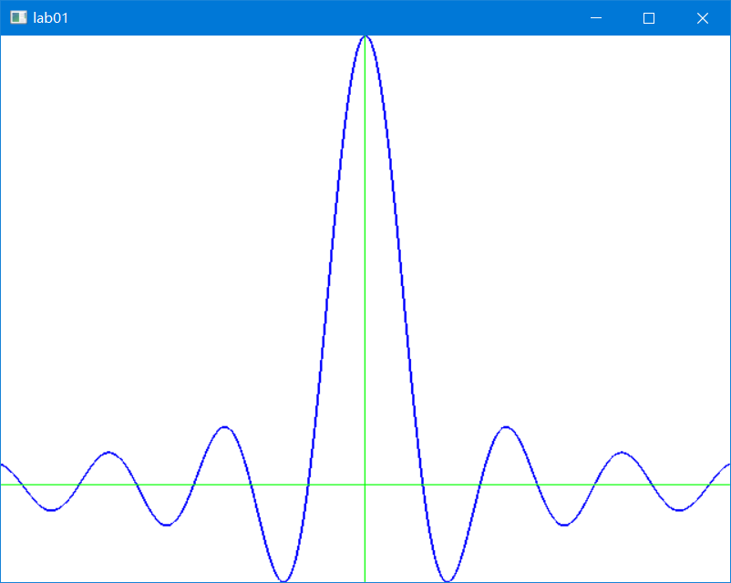
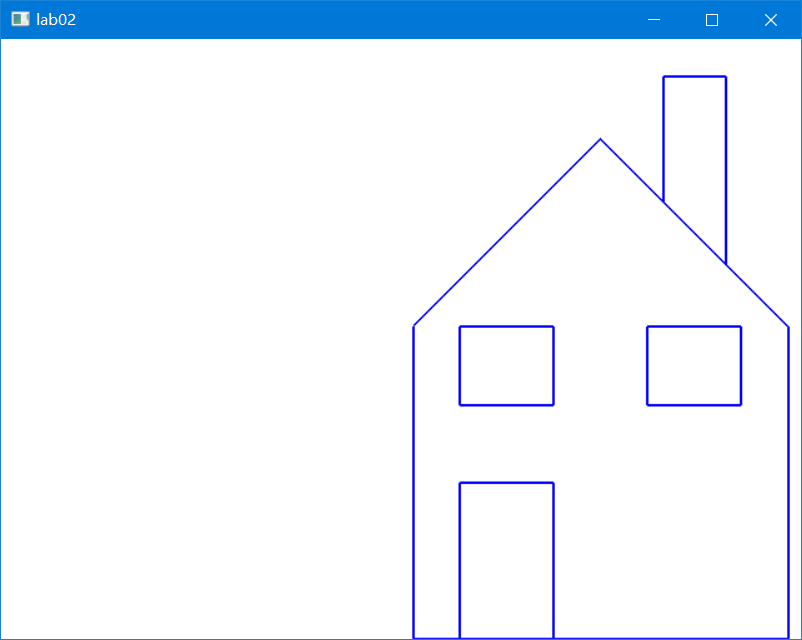
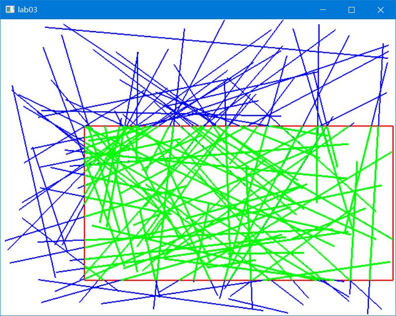
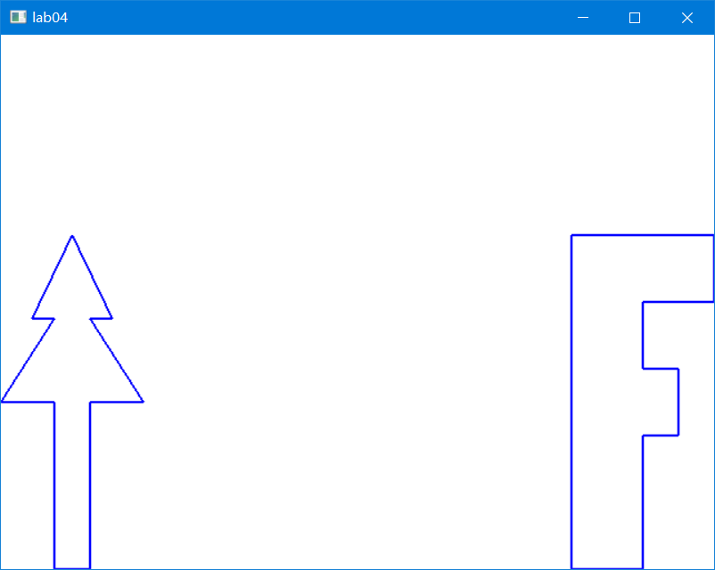
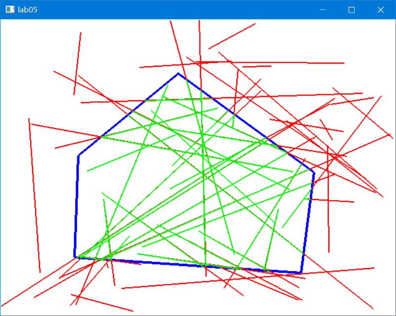
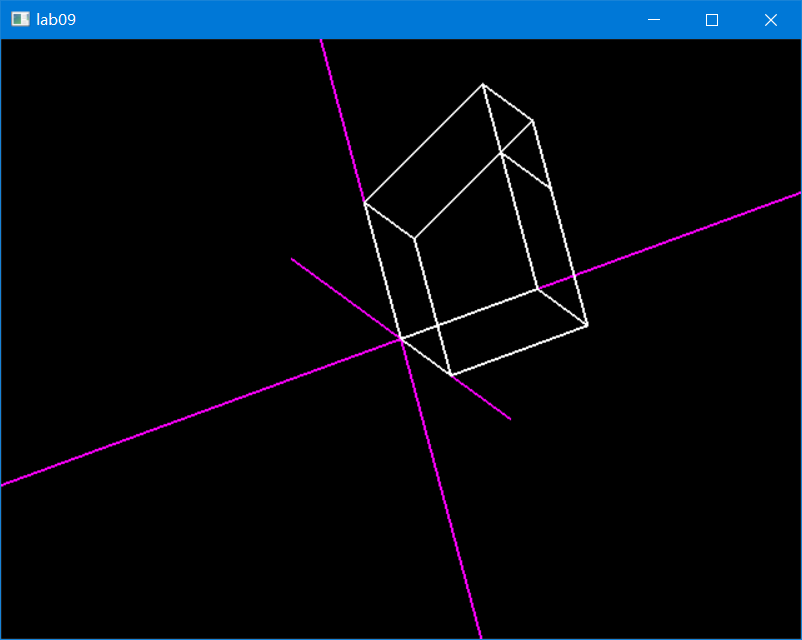
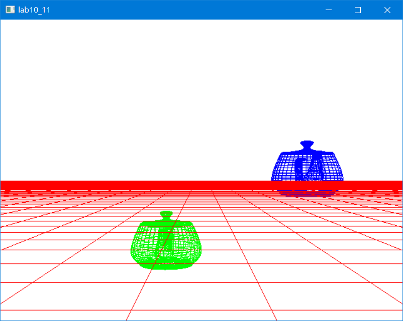

### NKU-SE Computer Graphics(2022-2023)
--- 
labs files and codes.<br>
**Contact me:** 1913184@mail.nankai.edu.cn

Updated on Dec 9th (lab10_11)
#### Labs
- lab01:
  - 
    ```
    f(x) = sinx/x
    x is in [-20,20]
    Using the following transform:
    sx = Ax+B
    sy = Cy+D
    ```
  - **code：** [lab01.cpp](lab/lab01/lab01.cpp)
  - **result：** 
- lab02:
  - 
    ```
    Using a mouse and keyboard to do polyline editing.
    Begin('b')(create a new polyline)
    Delete('d')(delete the next point pointed to)
    Move('m')(drag the point pointed to to a new location)
    Refresh('r')(erase the screen and redraw all the polylines)
    Quit('q')(exit from the program)
    ```
    - **code：**[lab02.cpp](lab/lab02/lab02.cpp)
    - **result：** *lab/lab02/res.mp4*  
- lab03:
    - 
    ```
    Cohen-Sutherland Clipper
    ```
    - **code：**[lab03.cpp](lab/lab03/lab03.cpp)
    - **result：**
- lab04:
  - 
    ```
    Animation with tweening
    ```
  - **code：**[lab04.cpp](lab/lab04/lab04.cpp)
  - **result：** *lab/lab04/res.mp4*    
- lab05：
  - 
    ```
    Cyrus-Beck
    ```
  - **code：**[lab05.cpp](lab/lab05/lab05.cpp)
  - **result：** *lab/lab05/res.mp4*  
- lab09:
  - 
  ```
    Mesh
  ```
  - **code：**[lab09.cpp](lab/lab09/lab09.cpp)
  - **result：** *lab/lab09/res.png* 
- lab10_11:
  -  
  ```
    Flying” a Camera through a scene-1/2
  ```
  - **code：**[lab10_11.cpp](lab/lab10_11/lab10_11.cpp)
  - **result：** *lab/lab10_11/res.mp4* 
  